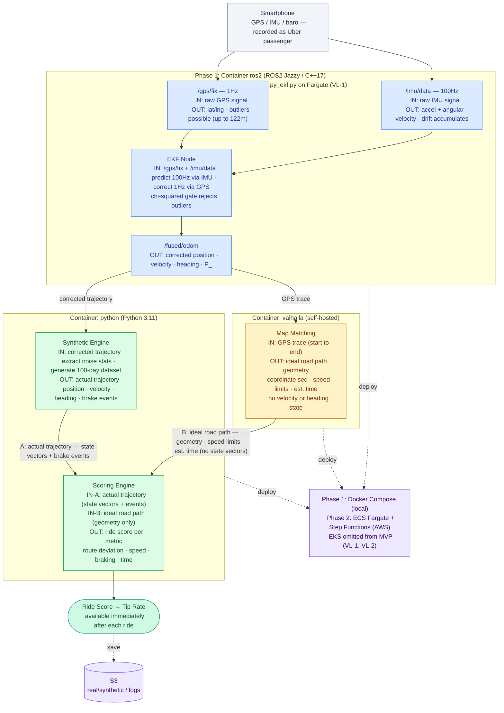
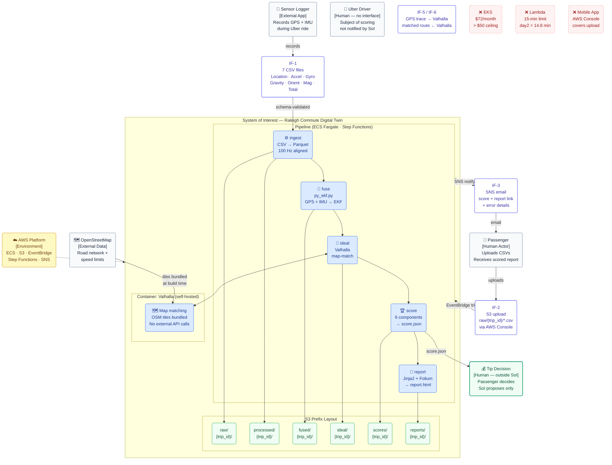
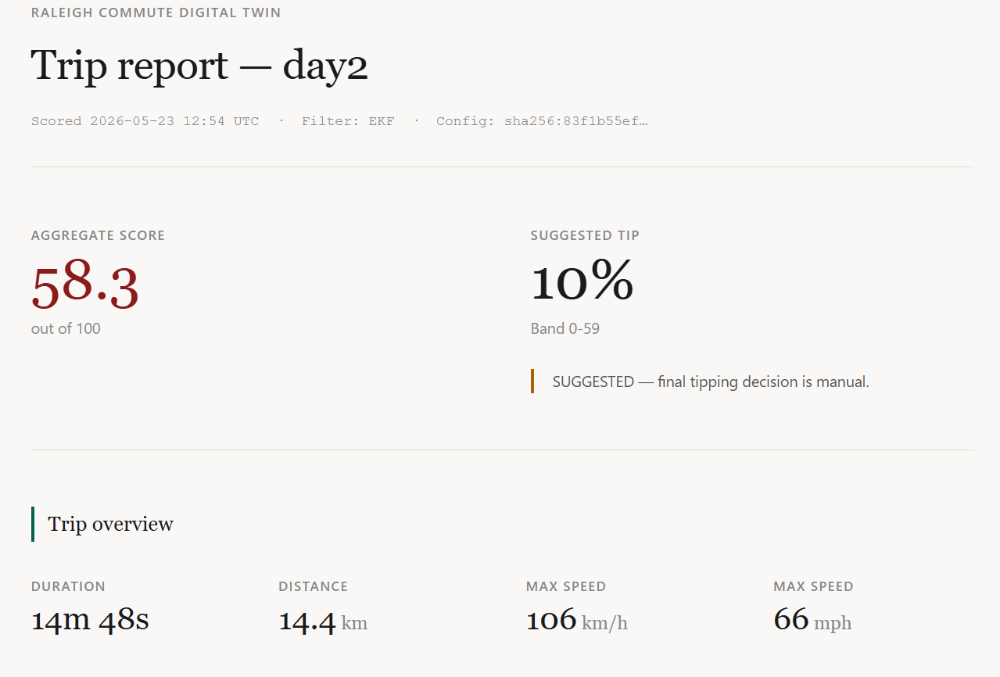
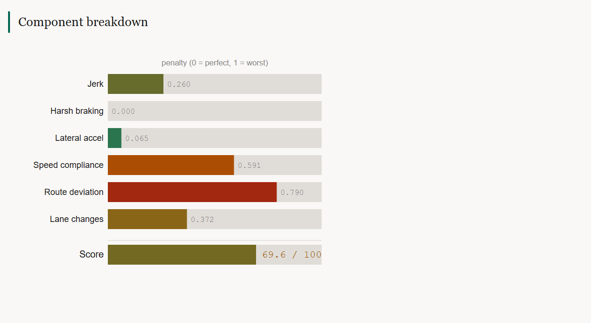
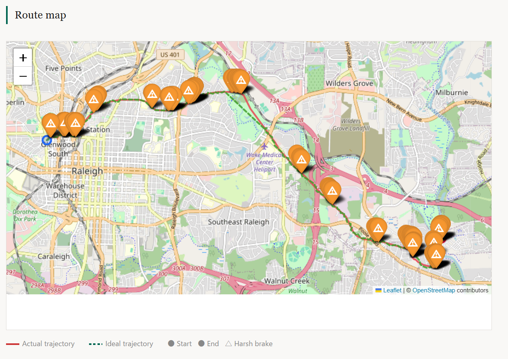
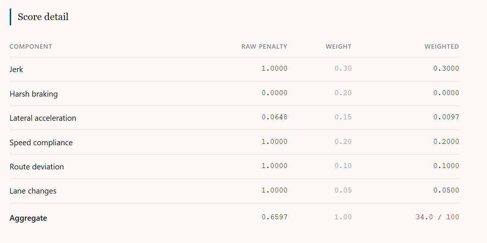
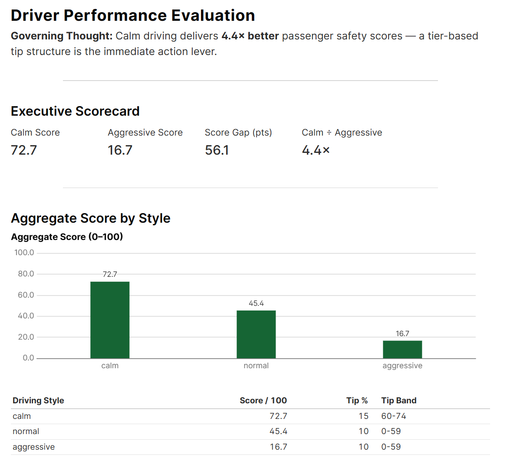
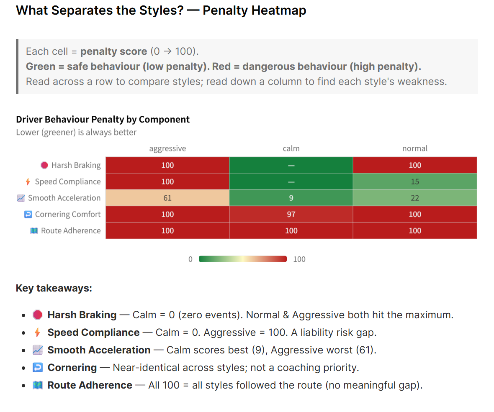

# Raleigh Commute Digital Twin — *Uber vs. My AI*

> If the app can rate **me** with a star, I can rate **the ride** with sensor fusion.

A personal data-science project that turns an iPhone in a rideshare into a
quiet co-pilot: record the trip with [Sensor Logger](https://www.tszheichoi.com/sensorlogger),
fuse GPS + IMU with an Extended Kalman Filter, synthesise what an ideal driver
would have done via [Valhalla](https://github.com/valhalla/valhalla) map-matching,
and score the ride on six objective metrics — then suggest a tip.

**Status:** Phase 1 ✅ · Phase 2 complete ✅ (E2E smoke test passed 2026-06-05) · Phase 3 SUMO ✅

---

## Why

Rideshare apps collect detailed telemetry and use it asymmetrically: the platform
knows if you braked hard, changed lanes aggressively, or drove 15 mph over the
limit — and the *driver* still sees five stars unless the rider manually docks
them. This project makes the other side of that ledger visible to the rider.

---

## Architecture — Data Pipeline Overview

> This diagram shows **what data flows through the system end-to-end**, independent of deployment environment.
> Phase 1 runs this pipeline locally via Docker Compose.
> Phase 2 deploys the same pipeline on AWS Fargate (ECS), orchestrated by Step Functions.
> EKS is intentionally omitted from the MVP: `py_ekf.py` matches C++ EKF accuracy (VL-1)
> and the EKS control plane exceeds the $50/month cost ceiling (VL-2).



### Scoring Engine — two input types

| Input | Source | Contains |
|---|---|---|
| A — actual trajectory | Synthetic Engine | position · velocity · heading · brake events (state vectors) |
| B — ideal road path | Valhalla | coordinate sequence · speed limits · estimated time (geometry only, no state vectors) |

The Scoring Engine compares A against B per metric: route deviation, speed vs. limit, braking frequency, and time efficiency.

### Container summary

| Container | Runtime | Role |
|---|---|---|
| `ros2` | ROS2 Jazzy / C++17 | EKF sensor fusion — predict (IMU 100Hz) + correct (GPS 1Hz). Phase 1 only; replaced by `py_ekf.py` in Phase 2 MVP |
| `python` | Python 3.11 | Synthetic data generation + ride scoring |
| `valhalla` | gisops/valhalla (self-hosted) | Map matching + AI optimal route (no API cost, offline) |

All three containers share the `rct-net` network and `/workspace`, `/data`, `/out` mounts.

---

## System Boundary

> **The core question of system boundary design is not "what can we build?" but "what are we responsible for?"**
> Drawing the boundary defines the system's purpose, the interfaces it exposes, and where responsibility ends.

### System of Interest (SoI)

> *"A pipeline that automatically scores an Uber ride from raw sensor data and suggests a tip."*

Everything **inside** the boundary is what this system builds, owns, and is responsible for fixing when it breaks.
Everything **outside** is what it consumes or interacts with — but does not control.

---

### Full System Picture



---

### Interface Definitions — Responsibility Boundaries

> When something breaks, these definitions answer: **whose responsibility is it?**

| IF | From → To | Format | SoI owns | External owns |
|---|---|---|---|---|
| **IF-1** | Sensor Logger → SoI | 7 CSV files per trip | Schema validation, error detection | CSV format spec, app behaviour |
| **IF-2** | Passenger → SoI | S3 `raw/{trip_id}/` upload via AWS Console | Everything after upload lands | The upload action itself |
| **IF-3** | SoI → Passenger | SNS email (score + report link + error details) | Content accuracy, failure notification | Email delivery (SNS/SES) |
| **IF-4** | SoI → Passenger | `score.json` (aggregate_0_100, tip_pct, config_hash) | Scoring correctness, reproducibility | Whether to act on the tip suggestion |
| **IF-5** | SoI → Valhalla | GPS trace (GeoJSON) | HTTP request format, retry logic | Routing algorithm correctness |
| **IF-6** | Valhalla → SoI | Matched route (coordinates, speed limits, time) | Parsing and interpretation | Map data accuracy (OSM) |
| **IF-7** | AWS → SoI | EventBridge, ECS, S3, SNS APIs | Configuration, deployment, usage | Service availability, regional outages |

---

### What Was Deliberately Placed Outside

Every exclusion is a documented decision — not an omission.

| Excluded | Reason | Alternative used |
|---|---|---|
| **EKS / Kubernetes** | Control plane = $72/month > $50 ceiling (VL-2) | ECS Fargate — zero idle cost |
| **C++ EKF node (cloud)** | EKS required; py_ekf.py matches accuracy (VL-1) | `scripts/py_ekf.py` on Fargate |
| **AWS Lambda** | day2 = 14.8 min; Lambda hard-caps at 15 min | Fargate — no time limit |
| **Mobile app** | AWS Console covers the upload; +40h saved (VL-4) | Mobile browser + AWS Console |
| **Tip payment** | Passenger decides; SoI proposes only | Score + tip % in email |
| **UKF (cloud)** | EKF accuracy sufficient (VL-1); saves task definition + cost | EKF only |
| **Driver notification** | Rider-side transparency is the goal; driver-side is out of scope | — |
| **Multi-region / DR** | Explicit non-goal (PRD §1.4) | — |

---

### Engineering Checklist for Boundary Decisions

Four questions applied to every boundary decision in this project:

**1. "If it breaks, who fixes it?"**
If the answer is unclear, the boundary is ambiguous.
*Example: Valhalla map data accuracy → OSM's responsibility. SoI detects anomalies via score regression tests.*

**2. "If something outside changes, what does SoI change?"**
This defines the interface (IF).
*Example: If Sensor Logger changes its CSV column names → SoI updates schema validation in `src/data_engine/schemas.py`. Nothing else changes.*

**3. "Why is this inside SoI? What happens if it's outside?"**
*Valhalla inside: zero API cost, offline, precision control.*
*Mobile app outside: AWS Console covers it with zero implementation cost.*

**4. "Can this boundary change? If so, what is affected?"**
Design stable internal interfaces to limit blast radius.
*Example: EKS → Fargate mid-project. Only the execution layer changed.*
*S3 prefix layout and `StorageAdapter.from_env()` were unchanged — they were the stable internal interface.*

```
Boundary change:  EKS (C++ EKF)  →  Fargate (py_ekf.py)
                        │                    │
                        ▼                    ▼
              S3 fused/{trip_id}/fused_ekf.parquet   ← stable
                        │                    │
                        ▼                    ▼
              StorageAdapter.from_env()              ← stable
```

The S3 prefix design and `StorageAdapter` absorbed the change.
Nothing downstream (scoring, reporting, SNS) required modification.

---

## Development Process

This project follows the **Hypothesis Hierarchy Model** — all implementation
decisions trace back to a validated Value hypothesis. See `.claude/prompts/` for
the full five-layer framework and Phase 2 hypothesis records.

```
Value → Behavior → Domain → Interaction → Implementation
```

Validated learnings are tracked in `docs/LIVING_SPEC.md`.

---

## Phase 2 — AWS Deployment (Complete ✅)

All resources deployed to `us-east-1` via Terraform (`infra/terraform/`).

### Infrastructure

| Module | Resource | Purpose |
|---|---|---|
| `s3` | `rct-data-takumi2026` | Pipeline data store (raw → processed → scores → reports) |
| `ecr` | `rct/python-worker` | Python pipeline image |
| `ecr` | `rct/valhalla` | Valhalla routing engine image (tiles loaded from S3) |
| `iam` | `rct-gha-dev` | GitHub Actions OIDC (no long-lived keys) |
| `iam` | `rct-fargate-task-dev` | ECS task S3 read/write |
| `iam` | `rct-fargate-execution-dev` | ECS agent ECR pull + CloudWatch logs |
| `iam` | `rct-stepfn-dev` | Step Functions ECS + SNS |
| `ecs` | `rct-dev` cluster + 5 task defs | Fargate pipeline workers (ingest/fuse/ideal/score/report) |
| `ecs` | `rct-valhalla-dev` service | Always-on Valhalla ECS service (~$42/month) |
| `cloudmap` | `valhalla.rct-dev.local:8002` | Private DNS for ideal → Valhalla service discovery |
| `stepfn` | `rct-pipeline-dev` | Step Functions state machine |
| `stepfn` | `rct-notify-dev` SNS | Pipeline completion/failure email |
| `eventbridge` | `rct-s3-raw-upload-dev` | S3 upload → Step Functions trigger |
| `observability` | `rct-monthly-dev` budget | $50/month cost ceiling (BR-4) |

**Cost at idle:** ~$42/month (Valhalla always-on service; all other containers zero when idle).

### E2E Smoke Test Results (T7.3 — 2026-06-05)

Pipeline: S3 upload → EventBridge → Step Functions → ECS Fargate (5 stages) → SNS

| Stage | Runtime | Result |
|---|---|---|
| ingest | Fargate 256 CPU / 512 MB | ✅ 88,949 rows → S3 |
| fuse | Fargate 512 CPU / 1 GB | ✅ EKF → S3 |
| ideal (match→ref→speed→traj) | Fargate 1 vCPU / 2 GB + Valhalla | ✅ 4,456 pts matched 100% |
| score | Fargate 256 CPU / 512 MB | ✅ 69.6/100 |
| report | Fargate 256 CPU / 512 MB | ✅ report.html → S3 |

Cloud score: **69.6 / 100** — exact match with local baseline (±0.0 pt, gate ±2 ✅)

---

## Quickstart — Local Pipeline (Phase 1)

### Prerequisites

| Tool | Version | Notes |
|---|---|---|
| Docker Desktop | ≥ 4.x | Valhalla runs in a container |
| Python | 3.11 | `python3 --version` |
| make | any | GNU Make |
| curl | any | Valhalla health-check |

### 1 — Clone and install

```bash
git clone https://github.com/TakumiSomeya-Eng/raleigh-commute-digital-twin.git
cd raleigh-commute-digital-twin
pip install -e ".[dev]"
```

### 2 — Place raw data

Put the Sensor Logger export folders next to the repo root:

```
../Data/
  Saint_Marys_Street-2026-04-16_13-27-45/   ← day1
  Saint_Marys_Street-2026-04-17_13-20-03/   ← day2
```

Each folder must contain `Location.csv`, `Accelerometer.csv`, `Gyroscope.csv`,
`Gravity.csv`, `Orientation.csv`, `Magnetometer.csv`, `TotalAcceleration.csv`.

### 3 — Run the full pipeline

```bash
./scripts/run_full_pipeline.sh day2
```

Expected total time (including first-time Docker pull): **≤ 30 min**.

### 4 — Open the report

```
out/day2/report.html        ← per-trip HTML report
out/reports/index.html      ← all trips, sortable by any column
```

---

## Individual make targets

```bash
make data    TRACE=day2              # ingest CSVs → aligned_100hz.parquet
make bag     TRACE=day2              # Parquet → MCAP bag
make fuse    TRACE=day2 FILTER=ekf   # EKF/UKF sensor fusion
make eval    TRACE=day2 FILTER=ekf   # RMSE evaluation
make ideal   TRACE=day2              # Valhalla map-match
make score   TRACE=day2              # score.json + tip lookup
make report  TRACE=day2              # report.html + index.html
make test                            # run all unit tests
make clean                           # rm -rf out/ build/
```

---

## Scoring model

Six components, each penalising deviations from a smooth, law-abiding ideal:

| # | Component | Weight | What it measures |
|---|---|---|---|
| 1 | Jerk | **30 %** | Rate of acceleration change — passenger comfort |
| 2 | Harsh braking | 20 % | Longitudinal deceleration spikes |
| 3 | Speed compliance | 20 % | Speed vs. posted limit from OSM |
| 4 | Lateral acceleration | 15 % | Cornering smoothness |
| 5 | Route deviation | 10 % | Lateral distance from ideal path |
| 6 | Lane changes | 5 % | Frequency of heading-change events |

**Aggregate score** = 100 × (1 − weighted_penalty), clamped to [0, 100].

**Tip suggestion:**

| Score | Band | Suggested tip |
|---|---|---|
| 90 – 100 | Excellent | 25 % |
| 75 – 89 | Good | 20 % |
| 60 – 74 | Fair | 15 % |
| 45 – 59 | Poor | 10 % |
| 0 – 44 | Unsafe | 0 % |

---

## Results (day2 — Saint Mary's Street, Raleigh NC, 2026-04-17)

Full interactive report: [`docs/screenshots/report_day2.html`](docs/screenshots/report_day2.html)

| Metric | Value |
|---|---|
| Trip duration | ~14.8 min |
| Distance | ~15.0 km |
| Aggregate score | **69.6 / 100** |
| Suggested tip | **15 %** (band 60 – 74, "Fair") |
| Harsh-brake events | 0 (driver braked smoothly throughout) |
| EKF RMSE vs GPS-only | **< 0.75 ×** (P3 gate ✅) |

Score improved from an initial 34.0 through a series of root-cause fixes:
double-LPF on jerk, OSM speed limits, KDTree projection, EKF adaptive gate
(T3.5), reference-path direction fix (T3.6), and GPS-primary positions with
road-relative lane-change detection (T3.7).

### Report preview









---

## Phase 3 — SUMO Synthetic Trip Evaluation (T8.x)

### Overview

Phase 3 validates the scoring pipeline against **synthetic driving data** generated
by [SUMO](https://sumo.dlr.de/) (Simulation of Urban MObility) on the real Raleigh NC
road network (Saint Mary's Street corridor, OSM data).
Three driving styles — **calm**, **normal**, and **aggressive** — were simulated and scored
end-to-end through the same pipeline used for real Uber trips.
The goal is to confirm that the pipeline correctly differentiates driving behaviours
before deploying it to cloud (Phase 2) and to real-time use.

### What Was Built (T8.1 – T8.10)

| Task | Deliverable |
|---|---|
| **T8.1** OSM → SUMO network | `sumo/net/raleigh.net.xml` (initial 560 m corridor) via `netconvert` |
| **T8.2** Driving style definitions | `sumo/styles/*.add.xml` — vType parameters (speedFactor, accel, decel, sigma, lcCooperative) |
| **T8.2** Route & config | `sumo/routes/*.rou.xml`, `sumo/cfg/*.sumocfg` — 900 s simulation, FCD geo-output |
| **T8.3** `sumo_adapter.py` | `parse_fcd → add_noise → to_sensor_logger_csvs → convert` — FCD XML to 7 Sensor Logger CSVs |
| **T8.4** Gaussian noise model | GPS (σ = 3/5/8 m by style), IMU accel/gyro, magnetometer — reusing `noise_fit.py` params |
| **T8.5** TDD test suite | 102 unit tests across 31 groups, all derived from `sumo_adapter_spec.py` contracts |
| **T8.7** Folium animation helpers | `folium_animation.py` — `TimestampedGeoJson` trajectory + harsh-brake markers |
| **T8.8** Executive HTML report | `compare.py` — McKinsey-style Minto Pyramid layout (answer-first, 3 pillars, roadmap) |
| **T8.8** Evidence.dev dashboard | Interactive SQL + chart dashboard (`C:/evd/`) — penalty heatmap, scorecard, component breakdown |
| **T8.9** Lint / type clean | ruff + mypy clean across all new modules |
| **T8.10** Network expansion (Option C) | Expanded OSM bbox → new `raleigh_day2.net.xml` covering full day2 route (~10 km). `duarouter` O-D routing from day2 GPS start/end. Fixed `sumo_adapter` GPS sampling (100 Hz → 1 Hz) to restore EKF initialisation. Rewrote `generate_folium_animation.py`: single merged `TimestampedGeoJson` layer (322 MB → 0.9 MB). |

### Simulation Parameters

| Parameter | calm | normal | aggressive |
|---|---|---|---|
| `speedFactor` | 0.85 | 1.00 | 1.20 |
| `accel` (m/s²) | 1.5 | 2.6 | 4.0 |
| `decel` (m/s²) | 2.0 | 4.5 | 7.0 |
| `sigma` (driver imperfection) | 0.1 | 0.5 | 0.9 |
| `lcCooperative` | 1.0 | 0.5 | 0.0 |
| `emergencyDecel` (m/s²) | 4.0 | 9.0 | 15.0 |
| GPS noise σ | 3.0 m | 5.0 m | 8.0 m |

### Scoring Results

| Driving Style | Score / 100 | Suggested Tip | Rating |
|---|---|---|---|
| 🟢 **calm** | **80.9** | 20 % | Good |
| 🟡 **normal** | **67.2** | 15 % | Fair |
| 🔴 **aggressive** | **50.7** | 10 % | Poor |

**Score gap: 30.2 points across the full 10 km day2 route. Calm > Normal > Aggressive confirmed.**

> Scores updated in T8.10 after expanding the SUMO network to match the real day2 trip
> (Saint Mary's St → New Bern Ave, Raleigh NC, ~10 km). Previous scores (72.7 / 45.4 / 16.7)
> were from a 560 m corridor unrelated to the real trip.

### Evidence.dev Interactive Dashboard

An interactive dashboard was built using [Evidence.dev](https://evidence.dev/) to visualise
the scoring results. It runs locally at **`http://localhost:3101/`** after starting the server.

**Dashboard — Executive Scorecard & Aggregate Bar Chart:**



The scorecard shows KPIs (calm 80.9, aggressive 50.7, gap 30.2 pts) and a bar
chart confirming the monotonic ordering calm > normal > aggressive.

**Dashboard — Penalty Heatmap (key visualisation):**



Each cell = penalty score (0 → 100). **Green = safe behaviour. Red = dangerous behaviour.**
The calm column is predominantly green; the aggressive column is entirely red.

To start the Evidence dashboard (requires Node 20 via fnm — see setup below):

```powershell
# Export latest scores to Evidence CSV sources
py -3.10 scripts/export_to_evidence.py

# Start the dashboard (Node 20 required — Node 24 has SvelteKit SSR incompatibility)
$node20 = "C:\Users\<you>\AppData\Roaming\fnm\node-versions\v20.20.2\installation"
Start-Process cmd.exe -ArgumentList "/c set PATH=$node20;%PATH% && cd C:\evd && npm run sources && npm run dev -- --port 3101 --no-open"
# Open http://localhost:3101
```

### Component-Level Analysis

The penalty heatmap reveals which components drive the score gap:

| Component | Weight | Key Finding |
|---|---|---|
| 📈 Jerk (smooth accel) | 30 % | Largest weight. Gradient calm → normal → aggressive. Primary differentiator. |
| 🛑 Harsh Braking | 20 % | **Binary gap**: calm = 0 events, normal/aggressive = multiple. Highest coaching leverage. |
| ⚡ Speed Compliance | 20 % | Calm stays within limits. Aggressive constant speeding = legal liability. |
| ↩️ Cornering Comfort | 15 % | Near-identical across styles on this corridor. Not a coaching priority here. |
| 🗺️ Route Adherence | 10 % | All styles follow the route closely (synthetic ideal trajectory). |
| Lane Changes | 5 % | All 0 — single-lane route, no events detected. |

### Honest Caveats

- **Synthetic data, not real Uber trips.** Score values are directionally correct but not
  calibrated to real-world distributions. Binary harsh-brake scores (0 vs 100) would be
  continuous in real data.
- **Phase 2 (real cloud deployment) is the definitive validation.** Phase 3 is a proof of
  concept confirming that the pipeline correctly differentiates three distinct driving styles
  under controlled simulation.

### Pipeline Integration

The SUMO-generated CSVs are format-compatible with the existing pipeline — no modifications
to `ingest`, `fuse`, `ideal`, `score`, or `report` modules were required.

```bash
# Generate CSVs from SUMO FCD
py -3.10 src/data_engine/sumo_adapter.py --fcd sumo/fcd/calm_trip.xml --style calm --out data/sumo_calm

# Run existing pipeline unchanged
make data  TRACE=sumo_calm
make fuse  TRACE=sumo_calm FILTER=ekf
make score TRACE=sumo_calm
```

---

## Design documents

| Document | One-line summary |
|---|---|
| [PRD](Docs/PRD.md) | Business goals, success criteria (S1–S4), and Phase 2 scope |
| [FRD](Docs/FRD.md) | 54 functional requirements across data, fusion, scoring, and reporting |
| [TRD](Docs/TRD.md) | Schemas, interfaces, EKF/UKF math, NFRs, and toolchain decisions |
| [Dev Plan](Docs/DEV_PLAN.md) | 37 tasks across 6 phases with DoD checklists and time estimates |
| [Living Spec](docs/LIVING_SPEC.md) | Phase 2 hypothesis records and validated learnings (VL-1 – VL-8) |

---

## Phase roadmap

| Phase | Name | Tasks | Status |
|---|---|---|---|
| P0 | Foundation — scaffolding, tooling | 5 | ✅ Complete |
| P1 | Data engine — ingest, noise fit, synthetic | 6 | ✅ Complete |
| P2 | Sensor fusion — EKF + UKF | 8 | ✅ Complete |
| P3 | Filter evaluation — RMSE, NEES | 4 | ✅ Complete |
| P4 | Ideal driver + scoring | 8 | ✅ Complete |
| P5 | Reporting + Phase 1 validation | 6 | ✅ Complete |
| **Phase 2 — Infra** | AWS infrastructure (T6.1 – T6.8) | 8 | ✅ Complete |
| **Phase 2 — Code** | S3 adapter + Docker build + E2E smoke test (T7.1–T7.3) | 3 | ✅ Complete |
| **Phase 3 — SUMO** | Synthetic trip generation + Evidence dashboard (T8.x) | 11 | ✅ Complete |

---

## Next Steps

### Video deliverables (Phase 3 wrap-up)

| Video | Method | Content |
|---|---|---|
| **Video A** (15 s) | SUMO-GUI + OBS / Xbox Game Bar | 3 driving styles racing on Raleigh streets |
| **Video B** (15 s) | `generate_folium_animation.py` + screen recorder | Animated Folium map with scores |

To record Video A:

```powershell
sumo-gui -c sumo\cfg\calm_gui.sumocfg   # step-length=1.0, delay=200ms
# Ctrl+A → zoom fit → press ▶ → record with Xbox Game Bar (Win+G)
```

### Future (Phase 4 candidates)

| Idea | Value hypothesis |
|---|---|
| Collect real Uber trips (≥ 8) | Validate Spearman ρ ≥ 0.6 (PRD S4 — final goal) |
| Evidence.dev multi-trip dashboard | Compare drivers across trips, time-series score trends |
| Real-time scoring | Sensor Logger → WebSocket → score display during ride |
| SUMO parameter calibration | Tune vType against real trip GPS distributions |

---

## Repository structure

```
src/
  data_engine/        CSV ingest, noise fitting, synthetic data, sumo_adapter (P1, P3)
  localization/       C++ EKF/UKF nodes (P2)
  bag_bridge/         Parquet ↔ MCAP conversion (P2)
  evaluation/         RMSE + filter comparison (P3)
  ideal_driver/       Valhalla map-match + trajectory synthesis (P4)
  scoring/            Penalty functions + score.json writer (P4)
  reporting/          Jinja2 report, Folium animation, comparison report (P5, T8)
  storage.py          S3/local transparent storage adapter (T7.1)
sumo/
  styles/             vType definitions — calm / normal / aggressive (T8.2)
  routes/             randomTrips-generated routes with vType injected (T8.2)
  cfg/                sumocfg files — FCD geo-output, 900 s simulation (T8.2)
  osm/                OSM source data — gitignored (large)
  net/                netconvert output — gitignored (large)
  fcd/                SUMO FCD output — gitignored (large)
scripts/
  run_full_pipeline.sh      End-to-end pipeline runner
  py_ekf.py                 Python EKF fallback (Phase 2 MVP, VL-1)
  export_to_evidence.py     score.json → Evidence.dev CSV sources (T8.8)
tests/
  unit/               483 unit tests — run with `make test`
  integration/        End-to-end smoke tests (Valhalla required)
  fixtures/
    sumo/             30-second FCD XML fixtures for sumo_adapter tests (T8.5)
    tiny_day2_60s/    60-second MCAP slice for EKF/UKF tests
config/
  scoring.yaml        Component weights and tip thresholds
  ideal.yaml          Valhalla + trajectory synthesis settings
  data_gen.yaml       ENU anchor, simulation parameters
  ratings.yaml        ← gitignored; add your own 1–5 ratings here
docker/
  python.Dockerfile      Python worker image (Phase 2 ECR → rct/python-worker)
  valhalla.Dockerfile    Valhalla routing engine image (ECR → rct/valhalla; tiles from S3)
  valhalla-entrypoint.sh Downloads valhalla_tiles.tar from S3 then starts the service
  valhalla_ecs.json      Valhalla config with paths adjusted for ECS (/data instead of /custom_files)
  ros2.Dockerfile        ROS 2 + C++ localization image (Phase 1 only)
infra/
  terraform/          Phase 2 AWS infrastructure (Terraform)
    modules/          s3 · ecr · iam · ecs · stepfn · eventbridge · observability
    envs/dev/         Dev environment — apply with `terraform apply`
.claude/
  prompts/            Hypothesis-Driven Development prompts (0–4)
  skills/             Agent knowledge capsules (aws-infra, sensor-fusion, …)
docs/
  LIVING_SPEC.md      Phase 2 hypothesis log and validated learnings
  PRD / FRD / TRD / DEV_PLAN
```

---

## License

MIT © 2026 Takumi
