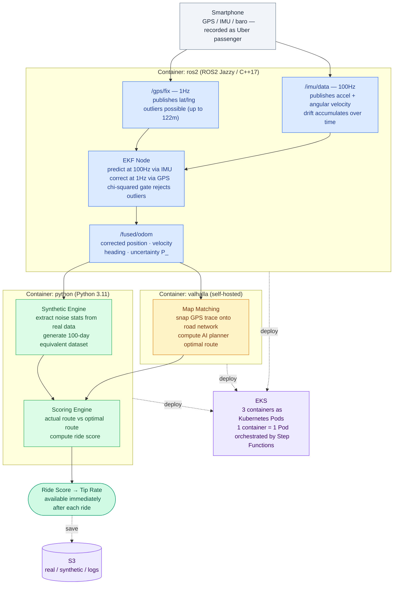

# Raleigh Commute Digital Twin — *Uber vs. My AI*

> If the app can rate **me** with a star, I can rate **the ride** with sensor fusion.

A personal data-science project that turns an iPhone in a rideshare into a
quiet co-pilot: record the trip with [Sensor Logger](https://www.tszheichoi.com/sensorlogger),
fuse GPS + IMU with an Extended Kalman Filter, synthesise what an ideal driver
would have done via [Valhalla](https://github.com/valhalla/valhalla) map-matching,
and score the ride on six objective metrics — then suggest a tip.

**Status:** Phase 1 complete ✅ · Phase 2 infrastructure complete ✅ · Phase 2 E2E pending Docker image 🚧

---

## Why

Rideshare apps collect detailed telemetry and use it asymmetrically: the platform
knows if you braked hard, changed lanes aggressively, or drove 15 mph over the
limit — and the *driver* still sees five stars unless the rider manually docks
them. This project makes the other side of that ledger visible to the rider.

---
## Architecture — Data Pipeline Overview

> This diagram shows **what data flows through the system end-to-end**, independent of deployment environment.  
> Phase 1 runs this pipeline locally via Docker Compose.  
> Phase 2 deploys the same containers to AWS EKS.



| Container | Runtime | Role |
|---|---|---|
| `ros2` | ROS2 Jazzy / C++17 | EKF sensor fusion — predict (IMU 100Hz) + correct (GPS 1Hz) |
| `python` | Python 3.11 | Synthetic data generation + ride scoring |
| `valhalla` | gisops/valhalla (self-hosted) | Map matching + AI optimal route (no API cost, offline) |

All three containers share the `rct-net` network and `/workspace`, `/data`, `/out` mounts.

---


> **Why no EKS?** The EKS control plane costs $72/month, exceeding the $50/month
> ceiling (VL-2). `py_ekf.py` achieves identical accuracy to the C++ EKF (VL-1),
> so the MVP omits EKS entirely.

---

## Development Process

This project follows the **Hypothesis Hierarchy Model** — all implementation
decisions trace back to a validated Value hypothesis. See `.claude/prompts/` for
the full five-layer framework and Phase 2 hypothesis records.

```
Value → Behavior → Domain → Interaction → Implementation
```

Validated learnings are tracked in `docs/LIVING_SPEC.md`.

---

## Phase 2 Infrastructure (AWS) — Completed 2026-05-30

All resources deployed to `us-east-1` via Terraform (`infra/terraform/`).

| Module | Resource | Purpose |
|---|---|---|
| `s3` | `rct-data-takumi2026` | Pipeline data store (raw → processed → scores → reports) |
| `ecr` | `rct/python-worker` | Docker image registry |
| `iam` | `rct-gha-dev` | GitHub Actions OIDC (no long-lived keys) |
| `iam` | `rct-fargate-task-dev` | ECS task S3 read/write |
| `iam` | `rct-fargate-execution-dev` | ECS agent ECR pull + CloudWatch logs |
| `iam` | `rct-stepfn-dev` | Step Functions ECS + SNS |
| `ecs` | `rct-dev` cluster + 5 task defs | Fargate pipeline workers |
| `stepfn` | `rct-pipeline-dev` | Orchestration state machine |
| `stepfn` | `rct-notify-dev` SNS | Pipeline completion/failure email |
| `eventbridge` | `rct-s3-raw-upload-dev` | S3 upload → Step Functions trigger |
| `observability` | `rct-monthly-dev` budget | $50/month cost ceiling (BR-4) |

**Cost at idle:** ~$0/month (no running containers, no EKS control plane).

---

## Phase 2 — Next Steps (T7.x)

Before the E2E smoke test can pass, the Phase 1 Python code needs three changes:

1. **S3 adapter** — replace local file paths with `boto3` S3 read/write
2. **Docker build** — build `docker/python.Dockerfile` and push to ECR
3. **E2E validation** — upload day2 CSVs to S3, assert `score.json` within ±2 of baseline 34.8

---

## Quickstart — Local Pipeline (Phase 1)

### Prerequisites

| Tool | Version | Notes |
|---|---|---|
| Docker Desktop | ≥ 4.x | Valhalla runs in a container |
| Python | 3.11 | `python3 --version` |
| make | any | GNU Make |
| curl | any | Valhalla health-check |

### 1 — Clone and install

```bash
git clone https://github.com/TakumiSomeya-Eng/raleigh-commute-digital-twin.git
cd raleigh-commute-digital-twin
pip install -e ".[dev]"
```

### 2 — Place raw data

Put the Sensor Logger export folders next to the repo root:

```
../Data/
  Saint_Marys_Street-2026-04-16_13-27-45/   ← day1
  Saint_Marys_Street-2026-04-17_13-20-03/   ← day2
```

Each folder must contain `Location.csv`, `Accelerometer.csv`, `Gyroscope.csv`,
`Gravity.csv`, `Orientation.csv`, `Magnetometer.csv`, `TotalAcceleration.csv`.

### 3 — Run the full pipeline

```bash
./scripts/run_full_pipeline.sh day2
```

Expected total time (including first-time Docker pull): **≤ 30 min**.

### 4 — Open the report

```
out/day2/report.html        ← per-trip HTML report
out/reports/index.html      ← all trips, sortable by any column
```

---

## Individual make targets

```bash
make data    TRACE=day2              # ingest CSVs → aligned_100hz.parquet
make bag     TRACE=day2              # Parquet → MCAP bag
make fuse    TRACE=day2 FILTER=ekf   # EKF/UKF sensor fusion
make eval    TRACE=day2 FILTER=ekf   # RMSE evaluation
make ideal   TRACE=day2              # Valhalla map-match
make score   TRACE=day2              # score.json + tip lookup
make report  TRACE=day2              # report.html + index.html
make test                            # run all unit tests
make clean                           # rm -rf out/ build/
```

---

## Scoring model

Six components, each penalising deviations from a smooth, law-abiding ideal:

| # | Component | Weight | What it measures |
|---|---|---|---|
| 1 | Jerk | 20 % | Rate of acceleration change — passenger comfort |
| 2 | Harsh braking | 20 % | Longitudinal deceleration spikes |
| 3 | Lateral acceleration | 20 % | Cornering smoothness |
| 4 | Speed compliance | 15 % | Speed vs. posted limit from OSM |
| 5 | Route deviation | 15 % | Lateral distance from ideal path |
| 6 | Lane changes | 10 % | Frequency of heading-change events |

**Aggregate score** = 100 × (1 − weighted_penalty), clamped to [0, 100].

**Tip suggestion:**

| Score | Band | Suggested tip |
|---|---|---|
| 90 – 100 | Excellent | 25 % |
| 75 – 89 | Good | 20 % |
| 60 – 74 | Fair | 15 % |
| 45 – 59 | Poor | 10 % |
| 0 – 44 | Unsafe | 0 % |

---

## Results (day2 — Saint Mary's Street, Raleigh NC, 2026-04-17)

Full interactive report: [`docs/screenshots/report_day2.html`](docs/screenshots/report_day2.html)

| Metric | Value |
|---|---|
| Trip duration | ~14.8 min |
| Distance | ~15.0 km |
| Aggregate score | **69.6 / 100** |
| Suggested tip | **15 %** (band 60 – 74, "Fair") |
| Harsh-brake events | 0 (driver braked smoothly throughout) |
| EKF RMSE vs GPS-only | **< 0.75 ×** (P3 gate ✅) |

Score improved from an initial 34.0 through a series of root-cause fixes:
double-LPF on jerk, OSM speed limits, KDTree projection, EKF adaptive gate
(T3.5), reference-path direction fix (T3.6), and GPS-primary positions with
road-relative lane-change detection (T3.7).

### Report preview


---

## Design documents

| Document | One-line summary |
|---|---|
| [PRD](Docs/PRD.md) | Business goals, success criteria (S1–S4), and Phase 2 scope |
| [FRD](Docs/FRD.md) | 54 functional requirements across data, fusion, scoring, and reporting |
| [TRD](Docs/TRD.md) | Schemas, interfaces, EKF/UKF math, NFRs, and toolchain decisions |
| [Dev Plan](Docs/DEV_PLAN.md) | 37 tasks across 6 phases with DoD checklists and time estimates |
| [Living Spec](docs/LIVING_SPEC.md) | Phase 2 hypothesis records and validated learnings (VL-1 – VL-8) |

---

## Phase roadmap

| Phase | Name | Tasks | Status |
|---|---|---|---|
| P0 | Foundation — scaffolding, tooling | 5 | ✅ Complete |
| P1 | Data engine — ingest, noise fit, synthetic | 6 | ✅ Complete |
| P2 | Sensor fusion — EKF + UKF | 8 | ✅ Complete |
| P3 | Filter evaluation — RMSE, NEES | 4 | ✅ Complete |
| P4 | Ideal driver + scoring | 8 | ✅ Complete |
| P5 | Reporting + Phase 1 validation | 6 | ✅ Complete |
| **Phase 2 — Infra** | AWS infrastructure (T6.1 – T6.8) | 8 | ✅ Complete |
| **Phase 2 — Code** | S3 adapter + Docker build + E2E (T7.x) | TBD | 🚧 Next |

---

## Repository structure

```
src/
  data_engine/        CSV ingest, noise fitting, synthetic data (P1)
  localization/       C++ EKF/UKF nodes (P2)
  bag_bridge/         Parquet ↔ MCAP conversion (P2)
  evaluation/         RMSE + filter comparison (P3)
  ideal_driver/       Valhalla map-match + trajectory synthesis (P4)
  scoring/            Penalty functions + score.json writer (P4)
  reporting/          Jinja2 report, SVG chart, Folium map, index (P5)
scripts/
  run_full_pipeline.sh   End-to-end pipeline runner
  py_ekf.py              Python EKF fallback (Phase 2 MVP, VL-1)
tests/
  unit/               360 unit tests — run with `make test`
  integration/        End-to-end smoke tests (Valhalla required)
  fixtures/           60-second MCAP slices for fast tests
config/
  scoring.yaml        Component weights and tip thresholds
  ideal.yaml          Valhalla + trajectory synthesis settings
  data_gen.yaml       ENU anchor, simulation parameters
  ratings.yaml        ← gitignored; add your own 1–5 ratings here
docker/
  python.Dockerfile   Python worker image (Phase 2 ECR target)
  ros2.Dockerfile     ROS 2 + C++ localization image
infra/
  terraform/          Phase 2 AWS infrastructure (Terraform)
    modules/          s3 · ecr · iam · ecs · stepfn · eventbridge · observability
    envs/dev/         Dev environment — apply with `terraform apply`
.claude/
  prompts/            Hypothesis-Driven Development prompts (0–4)
  skills/             Agent knowledge capsules (aws-infra, sensor-fusion, …)
docs/
  LIVING_SPEC.md      Phase 2 hypothesis log and validated learnings
  PRD / FRD / TRD / DEV_PLAN
```

---

## License

MIT © 2026 Takumi
