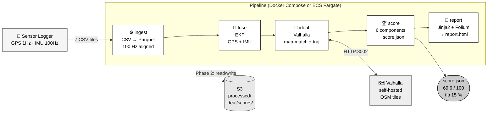
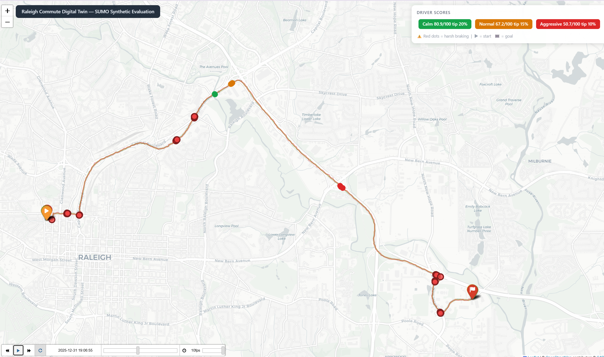

# Raleigh Commute Digital Twin — *Uber vs. My AI*

> If the app can rate **me** with a star, I can rate **the ride** with sensor fusion.

Record an Uber trip with [Sensor Logger](https://www.tszheichoi.com/sensorlogger) (iPhone),
fuse GPS + IMU through an Extended Kalman Filter, match the route against Valhalla's ideal path,
and score the driver on six objective metrics — then suggest a tip.

**Status:** Phase 1 ✅ · Phase 2 ✅ (E2E smoke test passed 2026-06-05) · Phase 3 ✅

---

## System Overview

The pipeline runs identically in two environments:

| Environment | Trigger | Where |
|---|---|---|
| **Phase 1 — Local** | `make score TRACE=day2` | Docker Compose on laptop |
| **Phase 2 — Cloud** | Upload CSVs to S3 | AWS Fargate + Step Functions |



### What each phase adds

| Phase | What was built | Purpose |
|---|---|---|
| **Phase 1** | Full local pipeline (Docker Compose) | Prove the algorithm works on real data |
| **Phase 2** | AWS deployment (Fargate + Step Functions + S3) | Enable multi-trip accumulation and automation |
| **Phase 3** | SUMO synthetic evaluation | Validate the scorer ranks calm > normal > aggressive |

---

## Results

### Real trip — day2 (Saint Mary's Street, Raleigh NC, 2026-04-17)

| Metric | Value |
|---|---|
| Trip duration | ~14.8 min |
| Distance | ~15.0 km |
| Aggregate score | **69.6 / 100** |
| Suggested tip | **15 %** (band 60–74, "Fair") |
| Harsh-brake events | 0 |
| EKF RMSE vs GPS-only | < 0.75 × (Phase 3 gate ✅) |
| Cloud vs local score | ±0.0 pt (Phase 2 gate ✅) |


### SUMO synthetic validation — 3 driving styles (Phase 3)

| Style | Score / 100 | Tip | Rating |
|---|---|---|---|
| 🟢 calm | **80.9** | 20 % | Good |
| 🟡 normal | **67.2** | 15 % | Fair |
| 🔴 aggressive | **50.7** | 10 % | Poor |

Simulated on the real day2 route (~10 km, Raleigh NC OSM). Calm > Normal > Aggressive confirmed.

**Video A — SUMO-GUI simulation (3 driving styles on Raleigh streets):**

<!-- markdownlint-disable MD033 -->
<video src="docs/videos/sumo_3styles_raleigh.mp4" controls width="100%"></video>
<!-- markdownlint-enable MD033 -->

**Video B — Folium animated route comparison (calm / normal / aggressive):**



---

## Quickstart

### Local — Phase 1 (Docker Compose)

**Prerequisites:** Docker Desktop ≥ 4.x · Python 3.11 · make · curl

```bash
git clone https://github.com/TakumiSomeya-Eng/raleigh-commute-digital-twin.git
cd raleigh-commute-digital-twin
pip install -e ".[dev]"
```

Place Sensor Logger exports in `Data/` next to the repo root:

```
Data/
  Saint_Marys_Street-2026-04-17_13-20-03/   ← day2 (Location.csv, Accelerometer.csv, …)
```

Run the full pipeline:

```bash
./scripts/run_full_pipeline.sh day2
# Output: out/day2/report.html
```

Individual steps:

```bash
make data    TRACE=day2              # CSV → aligned_100hz.parquet
make fuse    TRACE=day2 FILTER=ekf   # EKF sensor fusion
make ideal   TRACE=day2              # Valhalla map-match
make score   TRACE=day2              # score.json
make report  TRACE=day2              # report.html
make test                            # 483 unit tests
```

### Cloud — Phase 2 (AWS)

**Prerequisites:** AWS CLI · Terraform ≥ 1.7 · Docker (WSL on Windows)

```bash
# 1. Deploy infrastructure
cd infra/terraform/envs/dev
terraform init && terraform apply

# 2. Build and push images
aws ecr get-login-password --region us-east-1 | \
  docker login --username AWS --password-stdin <account>.dkr.ecr.us-east-1.amazonaws.com
docker build -f docker/python.Dockerfile -t <account>.dkr.ecr.us-east-1.amazonaws.com/rct/python-worker:latest .
docker push <account>.dkr.ecr.us-east-1.amazonaws.com/rct/python-worker:latest

# 3. Upload a trip and trigger the pipeline
aws s3 sync Data/Saint_Marys_Street-2026-04-17_13-20-03/ s3://rct-data-takumi2026/raw/day2/
# EventBridge detects the upload and starts Step Functions automatically.
# Score arrives via SNS email when complete.
```

---

## Scoring Model

Six components, each penalising deviations from a smooth, law-abiding ideal:

| # | Component | Weight | What it measures |
|---|---|---|---|
| 1 | Jerk | **30 %** | Rate of acceleration change — passenger comfort |
| 2 | Harsh braking | 20 % | Longitudinal deceleration spikes |
| 3 | Speed compliance | 20 % | Speed vs. posted limit (OSM) |
| 4 | Lateral acceleration | 15 % | Cornering smoothness |
| 5 | Route deviation | 10 % | Lateral distance from ideal path |
| 6 | Lane changes | 5 % | Frequency of heading-change events |

**Aggregate score** = 100 × (1 − weighted_penalty), clamped to [0, 100].

| Score | Band | Suggested tip |
|---|---|---|
| 90 – 100 | Excellent | 25 % |
| 75 – 89 | Good | 20 % |
| 60 – 74 | Fair | 15 % |
| 45 – 59 | Poor | 10 % |
| 0 – 44 | Unsafe | 0 % |

---

## Phase 1 — Local Pipeline

All logic lives in `src/`. The pipeline runs via Docker Compose with three containers:

| Container | Runtime | Role |
|---|---|---|
| `python` | Python 3.11 | ingest · fuse (py_ekf.py) · ideal · score · report |
| `valhalla` | gisops/valhalla 3.5.1 | Map matching + speed-limit lookup (self-hosted, no API cost) |
| `ros2` | ROS 2 Jazzy / C++17 | C++ EKF node — Phase 1 alternative; replaced by py_ekf.py in Phase 2 |

**Phase gate P3:** EKF RMSE ≤ 0.75 × GPS-only RMSE ✅

---

## Phase 2 — AWS Deployment

### Infrastructure (Terraform `infra/terraform/`)

| Resource | Purpose |
|---|---|
| S3 `rct-data-takumi2026` | Pipeline data store (raw → processed → ideal → scores → reports) |
| ECR `rct/python-worker` | Python pipeline image |
| ECR `rct/valhalla` | Valhalla image (tiles loaded from S3 on startup) |
| ECS cluster `rct-dev` | Fargate pipeline workers (5 task definitions) |
| ECS service `rct-valhalla-dev` | Always-on Valhalla (~$42/month, 1 vCPU / 4 GB) |
| Cloud Map `valhalla.rct-dev.local:8002` | Private DNS for ideal → Valhalla discovery |
| Step Functions `rct-pipeline-dev` | Orchestration (ingest → fuse → ideal → score → report) |
| EventBridge `rct-s3-raw-upload-dev` | S3 upload → Step Functions trigger |
| SNS `rct-notify-dev` | Pipeline completion / failure email |
| IAM roles | OIDC for GitHub Actions; least-privilege task roles |
| Budget `rct-monthly-dev` | $50/month cost ceiling alert |

**Cost at idle:** ~$42/month (Valhalla service; all other Fargate tasks zero when idle).

### E2E Smoke Test (2026-06-05)

| Stage | Fargate spec | Result |
|---|---|---|
| ingest | 256 CPU / 512 MB | ✅ 88,949 rows → S3 |
| fuse | 512 CPU / 1 GB | ✅ EKF → S3 |
| ideal (match → ref → speed → traj) | 1 vCPU / 2 GB + Valhalla | ✅ 4,456 pts matched 100% |
| score | 256 CPU / 512 MB | ✅ 69.6 / 100 |
| report | 256 CPU / 512 MB | ✅ report.html → S3 |

Cloud score: **69.6 / 100** — identical to local baseline (±0.0 pt, gate ±2 ✅)

### Key design decisions

| Decision | Reason |
|---|---|
| Fargate over EKS | EKS control plane = $72/month > $50 ceiling |
| py_ekf.py over C++ EKF | Matches C++ accuracy (VL-1); avoids EKS dependency |
| Fargate over Lambda | day2 = 14.8 min; Lambda hard limit = 15 min |
| Valhalla self-hosted | Zero API cost; tiles bundled in Docker image |
| StorageAdapter pattern | Single code path for local and S3; no conditional imports everywhere |

---

## Phase 3 — SUMO Synthetic Evaluation

Validates the scoring pipeline on **synthetic** driving data before committing to real multi-trip collection.

### What was built (T8.1 – T8.10)

| Task | Deliverable |
|---|---|
| T8.1–T8.2 | SUMO network (`raleigh_day2.net.xml`, ~10 km, OSM), 3 driving-style vTypes, routes, sumocfg |
| T8.3–T8.4 | `sumo_adapter.py` — FCD XML → 7 Sensor Logger CSVs with Gaussian noise |
| T8.5 | 102 unit tests derived from `sumo_adapter_spec.py` |
| T8.7–T8.8 | Folium animation (`generate_folium_animation.py`) + Evidence.dev dashboard |
| T8.9 | ruff + mypy clean |
| T8.10 | Network expansion to full day2 route; fixed GPS sampling 100 Hz → 1 Hz; Folium animation 322 MB → 0.9 MB |

### Simulation parameters

| Parameter | calm | normal | aggressive |
|---|---|---|---|
| `speedFactor` | 0.85 | 1.00 | 1.20 |
| `accel` (m/s²) | 1.5 | 2.6 | 4.0 |
| `decel` (m/s²) | 2.0 | 4.5 | 7.0 |
| `sigma` | 0.1 | 0.5 | 0.9 |
| GPS noise σ | 3.0 m | 5.0 m | 8.0 m |

### SUMO-GUI visualization

```powershell
sumo-gui -c sumo\cfg\calm_gui.sumocfg   # step-length=1.0, delay=200ms
# Ctrl+A → zoom fit → press ▶ → record with Xbox Game Bar (Win+G)
```

### Evidence.dev dashboard

```powershell
py -3.10 scripts/export_to_evidence.py   # export scores to CSV
# Start Evidence (requires Node 20)
Start-Process cmd.exe -ArgumentList "/c cd C:\evd && npm run dev -- --port 3101 --no-open"
# Open http://localhost:3101
```


### Component analysis

| Component | Weight | Key finding |
|---|---|---|
| Jerk | 30 % | Largest differentiator. Gradient calm → normal → aggressive. |
| Harsh braking | 20 % | Binary gap: calm = 0 events, others = multiple. |
| Speed compliance | 20 % | Calm stays within limits; aggressive constant speeding. |
| Lateral acceleration | 15 % | Near-identical across styles on this corridor. |
| Route adherence | 10 % | All styles follow the route closely. |
| Lane changes | 5 % | All 0 — single-lane route. |

---

## Next Steps

### Video deliverables (Phase 3 wrap-up)

| Video | Method | Content |
|---|---|---|
| Video A (15 s) | SUMO-GUI + OBS / Xbox Game Bar | 3 driving styles on Raleigh streets |
| Video B (15 s) | `generate_folium_animation.py` + screen recorder | Animated Folium map with scores |

### Phase 4 candidates

| Idea | Value hypothesis |
|---|---|
| Collect real Uber trips (≥ 8) | Validate Spearman ρ ≥ 0.6 (PRD S4 — final goal) |
| Evidence.dev multi-trip dashboard | Compare drivers across trips, time-series trends |
| Real-time scoring | Sensor Logger → WebSocket → live score during ride |
| SUMO calibration | Tune vType parameters against real GPS distributions |

---

## Design Documents

| Document | Summary |
|---|---|
| [PRD](Docs/PRD.md) | Business goals, success criteria (S1–S4) |
| [FRD](Docs/FRD.md) | 54 functional requirements |
| [TRD](Docs/TRD.md) | Schemas, EKF math, NFRs, toolchain |
| [Dev Plan](Docs/DEV_PLAN.md) | Task list with DoD checklists |
| [Living Spec](docs/LIVING_SPEC.md) | Validated learnings (VL-1 – VL-8) |
| [System Boundary](docs/SYSTEM_BOUNDARY.md) | SoI definition · interface table (IF-1〜7) · deliberate exclusions · boundary decision checklist |

---

## Repository Structure

```
src/
  data_engine/     CSV ingest · noise fitting · synthetic data · sumo_adapter
  localization/    C++ EKF/UKF nodes (Phase 1 ros2 container)
  bag_bridge/      Parquet ↔ MCAP conversion
  evaluation/      RMSE + filter comparison
  ideal_driver/    Valhalla map-match · reference path · speed profile · trajectory
  scoring/         Penalty functions · score.json writer
  reporting/       Jinja2 report · Folium animation · comparison report
  storage.py       StorageAdapter — transparent S3/local read-write (Phase 2)
scripts/
  run_full_pipeline.sh    Local end-to-end runner
  py_ekf.py               Python EKF (Phase 2 Fargate replacement for C++ node)
  generate_folium_animation.py   SUMO 3-style animated map (Phase 3)
  export_to_evidence.py   score.json → Evidence.dev CSV sources
sumo/
  styles/          vType definitions — calm / normal / aggressive
  routes/          duarouter O-D routes (day2 GPS start/end)
  cfg/             sumocfg — FCD geo-output, 900 s simulation
  gui/             settings.xml for SUMO-GUI visualization
docker/
  python.Dockerfile       Python worker image → ECR rct/python-worker
  valhalla.Dockerfile     Valhalla image → ECR rct/valhalla (tiles from S3)
  valhalla-entrypoint.sh  Downloads tiles from S3 then starts valhalla_service
  valhalla_ecs.json       Valhalla config for ECS (/data paths)
  ros2.Dockerfile         ROS 2 + C++ localization (Phase 1 only)
infra/
  terraform/
    modules/       s3 · ecr · iam · ecs · stepfn · eventbridge · observability
    envs/dev/      Dev environment — apply with terraform apply
tests/
  unit/            483 unit tests — run with make test
  fixtures/        MCAP slices · SUMO FCD XML fixtures
config/
  scoring.yaml     Component weights and tip thresholds
  ideal.yaml       Valhalla + trajectory synthesis settings
  data_gen.yaml    ENU anchor (Raleigh NC), simulation parameters
docs/
  LIVING_SPEC.md   Phase 2 hypothesis log and validated learnings
  PRD / FRD / TRD / DEV_PLAN
```

---

## License

MIT © 2026 Takumi
