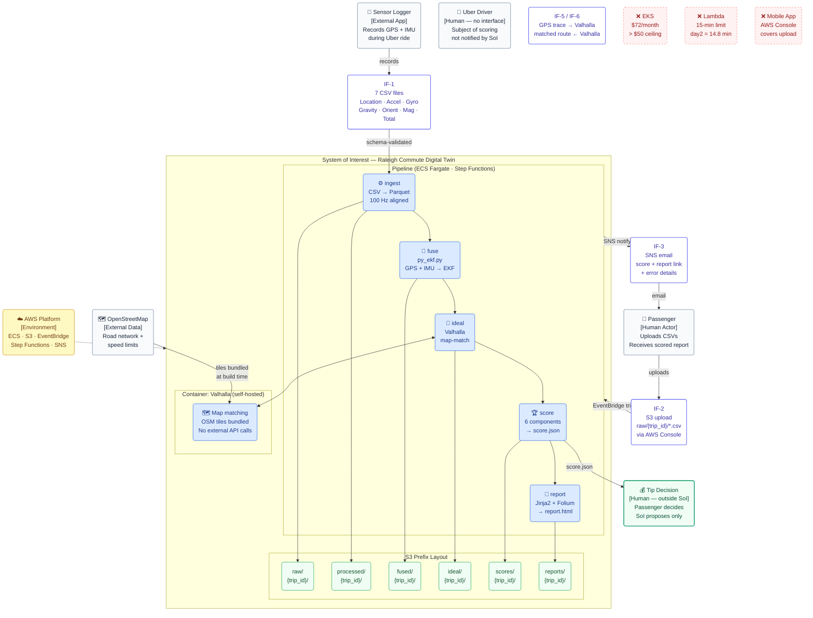

# System Boundary — Raleigh Commute Digital Twin

> **The core question of system boundary design is not "what can we build?" but "what are we responsible for?"**
> Drawing the boundary defines the system's purpose, the interfaces it exposes, and where responsibility ends.

## System of Interest (SoI)

> *"A pipeline that automatically scores an Uber ride from raw sensor data and suggests a tip."*

Everything **inside** the boundary is what this system builds, owns, and is responsible for fixing when it breaks.
Everything **outside** is what it consumes or interacts with — but does not control.

---

## Full System Picture



---

## Interface Definitions — Responsibility Boundaries

> When something breaks, these definitions answer: **whose responsibility is it?**

| IF | From → To | Format | SoI owns | External owns |
|---|---|---|---|---|
| **IF-1** | Sensor Logger → SoI | 7 CSV files per trip | Schema validation, error detection | CSV format spec, app behaviour |
| **IF-2** | Passenger → SoI | S3 `raw/{trip_id}/` upload via AWS Console | Everything after upload lands | The upload action itself |
| **IF-3** | SoI → Passenger | SNS email (score + report link + error details) | Content accuracy, failure notification | Email delivery (SNS/SES) |
| **IF-4** | SoI → Passenger | `score.json` (aggregate_0_100, tip_pct, config_hash) | Scoring correctness, reproducibility | Whether to act on the tip suggestion |
| **IF-5** | SoI → Valhalla | GPS trace (GeoJSON) | HTTP request format, retry logic | Routing algorithm correctness |
| **IF-6** | Valhalla → SoI | Matched route (coordinates, speed limits, time) | Parsing and interpretation | Map data accuracy (OSM) |
| **IF-7** | AWS → SoI | EventBridge, ECS, S3, SNS APIs | Configuration, deployment, usage | Service availability, regional outages |

---

## What Was Deliberately Placed Outside

Every exclusion is a documented decision — not an omission.

| Excluded | Reason | Alternative used |
|---|---|---|
| **EKS / Kubernetes** | Control plane = $72/month > $50 ceiling (VL-2) | ECS Fargate — zero idle cost |
| **C++ EKF node (cloud)** | EKS required; py_ekf.py matches accuracy (VL-1) | `scripts/py_ekf.py` on Fargate |
| **AWS Lambda** | day2 = 14.8 min; Lambda hard-caps at 15 min | Fargate — no time limit |
| **Mobile app** | AWS Console covers the upload; +40h saved (VL-4) | Mobile browser + AWS Console |
| **Tip payment** | Passenger decides; SoI proposes only | Score + tip % in email |
| **UKF (cloud)** | EKF accuracy sufficient (VL-1); saves task definition + cost | EKF only |
| **Driver notification** | Rider-side transparency is the goal; driver-side is out of scope | — |
| **Multi-region / DR** | Explicit non-goal (PRD §1.4) | — |

---

## Engineering Checklist for Boundary Decisions

Four questions applied to every boundary decision in this project:

**1. "If it breaks, who fixes it?"**
If the answer is unclear, the boundary is ambiguous.
*Example: Valhalla map data accuracy → OSM's responsibility. SoI detects anomalies via score regression tests.*

**2. "If something outside changes, what does SoI change?"**
This defines the interface (IF).
*Example: If Sensor Logger changes its CSV column names → SoI updates schema validation in `src/data_engine/schemas.py`. Nothing else changes.*

**3. "Why is this inside SoI? What happens if it's outside?"**
*Valhalla inside: zero API cost, offline, precision control.*
*Mobile app outside: AWS Console covers it with zero implementation cost.*

**4. "Can this boundary change? If so, what is affected?"**
Design stable internal interfaces to limit blast radius.
*Example: EKS → Fargate mid-project. Only the execution layer changed.*
*S3 prefix layout and `StorageAdapter.from_env()` were unchanged — they were the stable internal interface.*

```
Boundary change:  EKS (C++ EKF)  →  Fargate (py_ekf.py)
                        │                    │
                        ▼                    ▼
              S3 fused/{trip_id}/fused_ekf.parquet   ← stable
                        │                    │
                        ▼                    ▼
              StorageAdapter.from_env()              ← stable
```

The S3 prefix design and `StorageAdapter` absorbed the change.
Nothing downstream (scoring, reporting, SNS) required modification.
